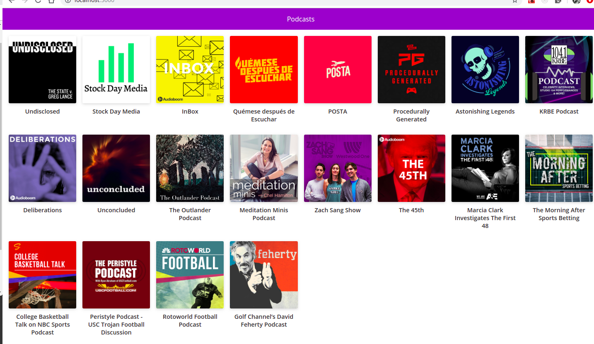

# Curso de Next.JS en Platzi

Este repositorio contiene todo el contenido del curso a medida que construimos una app para ver podcasts con la API de Audioboom.
link https://platzi-nextjs-1router-lpjw8slau.now.sh/
## ¿Como funciona? 
Requiere Node.JS 10

* `npm install` instalar dependencias.
* `npm run dev`  entorno de desarrollo
* `npm run build && npm satrt` para el entorno de produccion

MIT